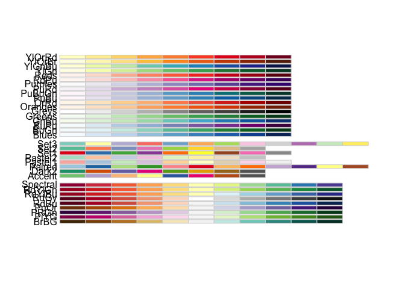

<!-- This file is edited in README.Rmd -->
Date: 2019-10-16

`R` version: 3.5.0

\*Corresponding author: <matthew.malishev@gmail.com>

This document can be found at <https://github.com/darwinanddavis/plot_it>

Overview
--------

Plotting function for switching between manuscript-ready and presentation style plots in `R`.

### Directions

:one: In your `R` file, run the following code.

``` r
require(RCurl)
```

    ## Loading required package: RCurl

    ## Warning: package 'RCurl' was built under R version 3.5.2

    ## Loading required package: bitops

``` r
script <- getURL("https://raw.githubusercontent.com/darwinanddavis/plot_it/master/plot_it.R", ssl.verifypeer = FALSE)
eval(parse(text = script))
```

:two: Use the following function to set your plotting parameters.

-   Specify if plotting for a manuscript or seminar (0/1)
-   Specify background colour (char)
-   Specify plotting colour palette 1 from RColorBrewer (char)
-   Specify plotting colour palette 2 from RColorBrewer (char)
-   Specify alpha transparency for plot points (int)
-   Specify font family for plot text (char)

``` r
require(RColorBrewer)
```

    ## Loading required package: RColorBrewer

``` r
display.brewer.all()
```



``` r
# Set global plotting parameters
cat("plot_it( \n0 for presentation, 1 for manuscript, \nset colour for background, \nset colour palette 1. use 'display.brewer.all()', \nset colour palette 2. use 'display.brewer.all()', \nset alpha for colour transperancy, \nset font style \n)")
```

    ## plot_it( 
    ## 0 for presentation, 1 for manuscript, 
    ## set colour for background, 
    ## set colour palette 1. use 'display.brewer.all()', 
    ## set colour palette 2. use 'display.brewer.all()', 
    ## set alpha for colour transperancy, 
    ## set font style 
    ## )

``` r
plot_it(0,"blue","Spectral","Greens",1,"mono") # set plot function params       
```

    ## Loading required package: sp

    ## Loading required package: ggplot2

    ## Warning: package 'ggplot2' was built under R version 3.5.2

    ## Loading required package: ggthemes

    ## Warning: package 'ggthemes' was built under R version 3.5.2

``` r
plot_it_gg("black","white") # specify background and foreground colours   
```

    ## List of 19
    ##  $ panel.background     :List of 5
    ##   ..$ fill         : chr "black"
    ##   ..$ colour       : chr "black"
    ##   ..$ size         : NULL
    ##   ..$ linetype     : NULL
    ##   ..$ inherit.blank: logi FALSE
    ##   ..- attr(*, "class")= chr [1:2] "element_rect" "element"
    ##  $ panel.grid.major     : list()
    ##   ..- attr(*, "class")= chr [1:2] "element_blank" "element"
    ##  $ panel.grid.minor     : list()
    ##   ..- attr(*, "class")= chr [1:2] "element_blank" "element"
    ##  $ plot.background      :List of 5
    ##   ..$ fill         : chr "black"
    ##   ..$ colour       : NULL
    ##   ..$ size         : NULL
    ##   ..$ linetype     : NULL
    ##   ..$ inherit.blank: logi FALSE
    ##   ..- attr(*, "class")= chr [1:2] "element_rect" "element"
    ##  $ axis.line            :List of 6
    ##   ..$ colour       : chr "white"
    ##   ..$ size         : NULL
    ##   ..$ linetype     : NULL
    ##   ..$ lineend      : NULL
    ##   ..$ arrow        : logi FALSE
    ##   ..$ inherit.blank: logi FALSE
    ##   ..- attr(*, "class")= chr [1:2] "element_line" "element"
    ##  $ axis.ticks           :List of 6
    ##   ..$ colour       : chr "white"
    ##   ..$ size         : NULL
    ##   ..$ linetype     : NULL
    ##   ..$ lineend      : NULL
    ##   ..$ arrow        : logi FALSE
    ##   ..$ inherit.blank: logi FALSE
    ##   ..- attr(*, "class")= chr [1:2] "element_line" "element"
    ##  $ plot.title           :List of 11
    ##   ..$ family       : NULL
    ##   ..$ face         : NULL
    ##   ..$ colour       : chr "white"
    ##   ..$ size         : NULL
    ##   ..$ hjust        : NULL
    ##   ..$ vjust        : NULL
    ##   ..$ angle        : NULL
    ##   ..$ lineheight   : NULL
    ##   ..$ margin       : NULL
    ##   ..$ debug        : NULL
    ##   ..$ inherit.blank: logi FALSE
    ##   ..- attr(*, "class")= chr [1:2] "element_text" "element"
    ##  $ text                 :List of 11
    ##   ..$ family       : chr "serif"
    ##   ..$ face         : NULL
    ##   ..$ colour       : NULL
    ##   ..$ size         : NULL
    ##   ..$ hjust        : NULL
    ##   ..$ vjust        : NULL
    ##   ..$ angle        : NULL
    ##   ..$ lineheight   : NULL
    ##   ..$ margin       : NULL
    ##   ..$ debug        : NULL
    ##   ..$ inherit.blank: logi FALSE
    ##   ..- attr(*, "class")= chr [1:2] "element_text" "element"
    ##  $ axis.title.x         :List of 11
    ##   ..$ family       : NULL
    ##   ..$ face         : NULL
    ##   ..$ colour       : chr "white"
    ##   ..$ size         : NULL
    ##   ..$ hjust        : NULL
    ##   ..$ vjust        : NULL
    ##   ..$ angle        : NULL
    ##   ..$ lineheight   : NULL
    ##   ..$ margin       : NULL
    ##   ..$ debug        : NULL
    ##   ..$ inherit.blank: logi FALSE
    ##   ..- attr(*, "class")= chr [1:2] "element_text" "element"
    ##  $ axis.title.y         :List of 11
    ##   ..$ family       : NULL
    ##   ..$ face         : NULL
    ##   ..$ colour       : chr "white"
    ##   ..$ size         : NULL
    ##   ..$ hjust        : NULL
    ##   ..$ vjust        : NULL
    ##   ..$ angle        : NULL
    ##   ..$ lineheight   : NULL
    ##   ..$ margin       : NULL
    ##   ..$ debug        : NULL
    ##   ..$ inherit.blank: logi FALSE
    ##   ..- attr(*, "class")= chr [1:2] "element_text" "element"
    ##  $ axis.text.x          :List of 11
    ##   ..$ family       : NULL
    ##   ..$ face         : NULL
    ##   ..$ colour       : chr "white"
    ##   ..$ size         : NULL
    ##   ..$ hjust        : NULL
    ##   ..$ vjust        : NULL
    ##   ..$ angle        : NULL
    ##   ..$ lineheight   : NULL
    ##   ..$ margin       : NULL
    ##   ..$ debug        : NULL
    ##   ..$ inherit.blank: logi FALSE
    ##   ..- attr(*, "class")= chr [1:2] "element_text" "element"
    ##  $ axis.text.y          :List of 11
    ##   ..$ family       : NULL
    ##   ..$ face         : NULL
    ##   ..$ colour       : chr "white"
    ##   ..$ size         : NULL
    ##   ..$ hjust        : NULL
    ##   ..$ vjust        : NULL
    ##   ..$ angle        : NULL
    ##   ..$ lineheight   : NULL
    ##   ..$ margin       : NULL
    ##   ..$ debug        : NULL
    ##   ..$ inherit.blank: logi FALSE
    ##   ..- attr(*, "class")= chr [1:2] "element_text" "element"
    ##  $ legend.background    : list()
    ##   ..- attr(*, "class")= chr [1:2] "element_blank" "element"
    ##  $ legend.box.background:List of 5
    ##   ..$ fill         : chr "transparent"
    ##   ..$ colour       : chr "transparent"
    ##   ..$ size         : NULL
    ##   ..$ linetype     : NULL
    ##   ..$ inherit.blank: logi FALSE
    ##   ..- attr(*, "class")= chr [1:2] "element_rect" "element"
    ##  $ legend.key           :List of 5
    ##   ..$ fill         : chr "transparent"
    ##   ..$ colour       : chr "transparent"
    ##   ..$ size         : NULL
    ##   ..$ linetype     : NULL
    ##   ..$ inherit.blank: logi FALSE
    ##   ..- attr(*, "class")= chr [1:2] "element_rect" "element"
    ##  $ legend.title         :List of 11
    ##   ..$ family       : NULL
    ##   ..$ face         : NULL
    ##   ..$ colour       : chr "white"
    ##   ..$ size         : NULL
    ##   ..$ hjust        : NULL
    ##   ..$ vjust        : NULL
    ##   ..$ angle        : NULL
    ##   ..$ lineheight   : NULL
    ##   ..$ margin       : NULL
    ##   ..$ debug        : NULL
    ##   ..$ inherit.blank: logi FALSE
    ##   ..- attr(*, "class")= chr [1:2] "element_text" "element"
    ##  $ legend.text          :List of 11
    ##   ..$ family       : NULL
    ##   ..$ face         : NULL
    ##   ..$ colour       : chr "white"
    ##   ..$ size         : NULL
    ##   ..$ hjust        : NULL
    ##   ..$ vjust        : NULL
    ##   ..$ angle        : NULL
    ##   ..$ lineheight   : NULL
    ##   ..$ margin       : NULL
    ##   ..$ debug        : NULL
    ##   ..$ inherit.blank: logi FALSE
    ##   ..- attr(*, "class")= chr [1:2] "element_text" "element"
    ##  $ strip.background     : list()
    ##   ..- attr(*, "class")= chr [1:2] "element_blank" "element"
    ##  $ strip.text           :List of 11
    ##   ..$ family       : NULL
    ##   ..$ face         : NULL
    ##   ..$ colour       : chr "white"
    ##   ..$ size         : NULL
    ##   ..$ hjust        : NULL
    ##   ..$ vjust        : NULL
    ##   ..$ angle        : NULL
    ##   ..$ lineheight   : NULL
    ##   ..$ margin       : NULL
    ##   ..$ debug        : NULL
    ##   ..$ inherit.blank: logi FALSE
    ##   ..- attr(*, "class")= chr [1:2] "element_text" "element"
    ##  - attr(*, "class")= chr [1:2] "theme" "gg"
    ##  - attr(*, "complete")= logi FALSE
    ##  - attr(*, "validate")= logi TRUE

:three: Make cool graphs.

Maintainer
----------

**Matt Malishev**
:mag: [Website](https://www.researchgate.net/profile/Matt_Malishev)
:bird: \[@darwinanddavis\](<https://twitter.com/darwinanddavis>)
:email: matthew.malishev \[at\] gmail.com
